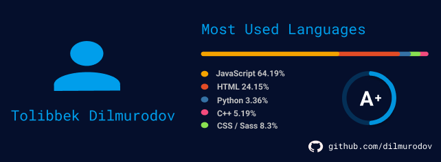

# Tolibbek Dilmurodov
### Frontend Developer.
****
#### Contact information:

__Phone:__ +998 99 683 32 18

__E-mail:__ tolibdilmurodov98@gmail.com

__Telegram:__ @alien0227

[LinkedIn](https://www.linkedin.com/in/tolib-dilmurodov-91a0a0204/)

[GitHub](https://github.com/dilmurodov)

***
#### Briefly About Myself:
Hi! My name is Tolib. I'm 19. I was born in Uzbekistan. Now I studying in Toshkent Information University of Technology. I'm fullstack devloper at MagicSoft Company in Tashkent. Developing, sport, music and reading are the most interesting things for me. I can develop Websites, CRM systems.

***
#### Skills and Proficiency:
* HTML5, CSS3, Sass(SCSS)
* JavaScript Intermediate
* Python, Django
* Git, GitHub
* VS Code, IntelliJ IDEA
* Adobe Photoshop, Figma, Prototyping

***
#### Code example:
**Sorting by bits** *In this* **KATA from CODEWARS:** *you're expected to sort an array of 32-bit integers in ascending order of the number of on bits they have.*
```javascript
function sortByBit(arr) {
  let count = (x) => (x).toString(2).split('').reduce((acc, item) => acc + +item, 0);
  arr = arr.sort((x, y) => count(x)-count(y) || x - y);
  return arr;
}
```
***
#### Courses:

* HTML, CSS and JS Tutorials on the Udemy (completed):



***
### Languages:

* English - Itmermediate
* Russian - Intermediate
* Uzbek - Native
